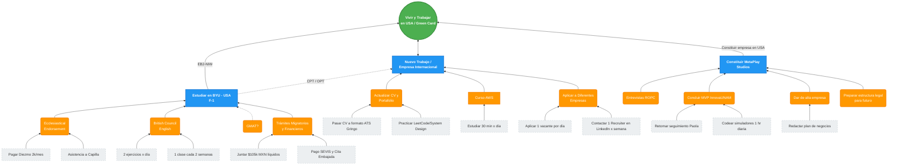

```mermaid
graph BT
    %% ==========================================
    %% DEFINICIÓN DE CLASES (CSS) PARA LOS COLORES
    %% ==========================================
    classDef Nivel1 fill:#4CAF50,stroke:#388E3C,stroke-width:3px,color:#fff,font-weight:bold;
    classDef Nivel2 fill:#2196F3,stroke:#1976D2,stroke-width:2px,color:#fff,font-weight:bold;
    classDef Nivel3 fill:#FF9800,stroke:#F57C00,stroke-width:2px,color:#fff;
    classDef Nivel4 fill:#ECEFF1,stroke:#B0BEC5,stroke-width:1px,color:#333,stroke-dasharray: 5 5;

    %% ==========================================
    %% NIVEL 1: LA META SUPERIOR (Verde)
    %% ==========================================
    Top(("Vivir y Trabajar <br> en USA / Green Card")):::Nivel1

    %% ==========================================
    %% NIVEL 2: LAS RUTAS PRINCIPALES (Azul)
    %% ==========================================
    BYU["Estudiar en BYU - USA <br> F-1"]:::Nivel2
    Job["Nuevo Trabajo / <br> Empresa Internacional"]:::Nivel2
    Startup["Constituir MetaPlay <br> Studios"]:::Nivel2

    %% Conexiones al Top Level
    BYU -- "EB2-NIW" --> Top
    Job <--> Top
    Startup -- "Constituir empresa en USA" --> Top
    
    %% Puente de estudiante a trabajo
    BYU -. "CPT / OPT" .-> Job

    %% ==========================================
    %% NIVEL 3: ACCIONES Y ESTRATEGIAS (Naranja)
    %% ==========================================

    %% ----- Rama BYU -----
    Endorse("Ecclesiastical <br> Endorsement"):::Nivel3 --> BYU
    English("British Council <br> English"):::Nivel3 --> BYU
    GMAT("GMAT?"):::Nivel3 -.-> BYU
    Visa("Trámites Migratorios <br> y Financieros"):::Nivel3 --> BYU 

    %% ----- Rama Trabajo -----
    CV("Actualizar CV y <br> Portafolio"):::Nivel3 --> Job
    AWS["Curso AWS"]:::Nivel3 --> Job
    Aplicar("Aplicar a Diferentes <br> Empresas"):::Nivel3 --> Job

    %% ----- Rama MetaPlay (Startup) -----
    ROPC("Entrevistas ROPC"):::Nivel3 --> Startup
    Paola("Retomar seguimiento Paola"):::Nivel4 --> MVP
    MVP("Concluir MVP InnovaUNAM"):::Nivel3 --> Startup
    Alta("Dar de alta empresa"):::Nivel3 --> Startup
    LegalUSA("Preparar estructura legal <br> para futuro"):::Nivel3 --> Startup 

    %% ==========================================
    %% NIVEL 4: MICRO-TAREAS / TRABAJO DIARIO (Gris)
    %% ==========================================

    %% Tareas de BYU
    Diezmo["Pagar Diezmo 2k/mes"]:::Nivel4 --> Endorse
    Capilla["Asistencia a Capilla"]:::Nivel4 --> Endorse
    
    Ejercicios["2 ejercicios x día"]:::Nivel4 --> English
    Clases["1 clase cada 2 semanas"]:::Nivel4 --> English
    
    Fondos["Juntar $105k MXN líquidos"]:::Nivel4 --> Visa 
    Embajada["Pago SEVIS y Cita Embajada"]:::Nivel4 --> Visa 

    %% Tareas de Trabajo
    Formato["Pasar CV a formato ATS Gringo"]:::Nivel4 --> CV 
    TechPrep["Practicar LeetCode/System Design"]:::Nivel4 --> CV 
    EstudiarAWS["Estudiar 30 min x día"]:::Nivel4 --> AWS
    Vacantes["Aplicar 1 vacante por día"]:::Nivel4 --> Aplicar
    Networking["Contactar 1 Recruiter en LinkedIn x semana"]:::Nivel4 --> Aplicar 

    %% Tareas de MetaPlay
    Desarrollo["Codear simuladores 1 hr diaria"]:::Nivel4 --> MVP
    Docs["Redactar plan de negocios"]:::Nivel4 --> Alta
```